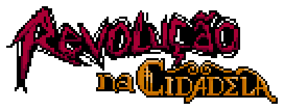

  

<h1 align="center">Revolução na Cidadela</h1>

Trabalho de Graduação • Fatec Campinas

**Revolução na Cidadela** é um Trabalho de Graduação desenvolvido no curso de **Análise e Desenvolvimento de Sistemas da Faculdade de Tecnologia de Campinas (Fatec Campinas)**.

Este repositório disponibiliza os scripts desenvolvidos durante a implementação do projeto como material complementar ao Trabalho de Graduação, permitindo a consulta da lógica utilizada na construção do jogo.

O objetivo deste repositório **não é disponibilizar uma versão jogável do projeto**, mas documentar a implementação realizada ao longo do desenvolvimento acadêmico.

---

## Sobre o projeto

**Revolução na Cidadela** é um RPG digital em 2D desenvolvido na Godot Engine cuja proposta foi integrar diferentes áreas da Engenharia de Software, como desenvolvimento de jogos, persistência de dados, arquitetura de software, testes automatizados e gerenciamento de projetos.

Durante o desenvolvimento foram implementados sistemas para:

- Criação de personagem;
- Gerenciamento de inventário;
- Sistema de equipamentos;
- Sistema de combate por turnos;
- Diálogos utilizando Dialogic;
- Persistência utilizando SQLite;
- Gerenciamento de salvamentos;
- Configurações do jogo;
- Interface gráfica;
- Recursos de acessibilidade;
- Testes automatizados.

O projeto foi desenvolvido seguindo a metodologia **Scrumban**, sendo acompanhado pelos docentes orientadores durante todo o Trabalho de Graduação.

---

## Objetivo deste repositório

Este repositório reúne exclusivamente os **scripts em GDScript** produzidos durante o desenvolvimento do projeto.

Não fazem parte deste repositório:

- Cenas (`.tscn`);
- Sprites;
- Tilesets;
- Animações;
- Músicas;
- Efeitos sonoros;
- Fontes;
- Recursos gráficos;
- Demais assets utilizados no projeto.

Sem esses recursos, o jogo **não pode ser executado**, sendo este material destinado exclusivamente para consulta da implementação realizada.

---

## Tecnologias utilizadas

- Godot Engine
- GDScript
- SQLite
- godot-sqlite
- Dialogic
- GdUnit4
- Git
- GitHub
- Notion

---

## Estrutura dos sistemas

### Interface

Responsável pela navegação entre telas, menus, configurações, créditos, confirmação de saída, HUD do combate e demais elementos visuais.

### Sistema de combate

Implementa o combate em turnos entre jogador e inimigos.

Entre as funcionalidades implementadas estão:

- Gerenciamento de turnos;
- Animações;
- Barras de vida;
- Mensagens de combate;
- Popups de dano;
- Quick Time Events (QTE);
- Modificadores por classe;
- Cálculo de dano;
- Indicadores visuais de turno.

A escolha das ações do inimigo utiliza uma função heurística para avaliar os ataques disponíveis considerando fatores como dano esperado, chance estimada de acerto, defesa do jogador e estado atual do combate.

### Sistema de persistência

A persistência dos dados é realizada por meio de um **singleton** responsável pelo acesso ao banco SQLite.

Esse módulo realiza automaticamente:

- Criação do banco de dados;
- Inicialização das tabelas;
- Inserção dos dados iniciais;
- Gerenciamento dos salvamentos;
- Carregamento dos personagens;
- Armazenamento das configurações do jogo;
- Consulta das classes e atributos;
- Gerenciamento do estado do jogador.

As principais entidades persistidas incluem:

- Personagens;
- Classes;
- Itens;
- Diálogos;
- NPCs;
- Missões;
- Salvamentos;
- Configurações.

### Sistema de diálogos

Os diálogos foram desenvolvidos utilizando o plugin **Dialogic**, permitindo a construção de árvores de diálogo e integração com o banco de dados do projeto.

### Sistema de inventário

O projeto possui um sistema de inventário responsável pelo armazenamento, exibição, utilização e gerenciamento dos itens do jogador, incluindo equipamentos que modificam atributos durante o combate.

---

## Testes

Como parte do Trabalho de Graduação foram desenvolvidos testes automatizados utilizando **GdUnit4**.

Os testes contemplam tanto componentes isolados quanto a integração entre diferentes sistemas do jogo.

Entre os módulos testados estão:

- Sistema de combate;
- Criação de personagem;
- Gerenciamento de salvamentos;
- Sistema de áudio;
- Configurações;
- Transição entre cenas;
- Persistência;
- Integração com banco de dados;
- Integração com Dialogic;
- Navegação entre menus;
- Subsistemas de diálogo.

---

## Organização do projeto

Os scripts foram desenvolvidos de forma modular, separando responsabilidades entre os diferentes sistemas do jogo, como interface, persistência, combate, inventário, diálogos e gerenciamento de estado.

A estrutura apresentada neste repositório corresponde apenas à camada lógica da aplicação, uma vez que as cenas e recursos utilizados pelo projeto original não são distribuídos.

---

## Contexto acadêmico

Este material corresponde ao código desenvolvido para o Trabalho de Graduação apresentado à Faculdade de Tecnologia de Campinas.

O repositório tem como finalidade:

- Servir como documentação complementar ao trabalho;
- Permitir a consulta da implementação desenvolvida;
- Auxiliar estudantes interessados no desenvolvimento de jogos utilizando a Godot Engine;
- Demonstrar as soluções implementadas durante o projeto.

---

## Equipe

### Desenvolvimento

- Aline Sakagushi
- Ana Carolina Cajuela
- Karen Yuzawa
- Rillory Teodora

### Apoio

- Anna Clara Antoniassi — Assets e dublagem
- Mayara Silva — Dublagem
- Iarlley Silveira — Dublagem

### Orientação

- **Prof. Me. Nelson Hideyoshi**
- **Prof. Dr. Thiago Alves**

---

## Licença e uso

Este repositório é disponibilizado exclusivamente para fins de estudo, consulta e documentação acadêmica.

As artes, personagens, narrativa, universo ficcional, identidade visual, textos e demais elementos criativos pertencem às respectivas autoras do projeto.

A disponibilização deste código **não autoriza sua reprodução, redistribuição, adaptação, comercialização ou utilização**, total ou parcial, em outros projetos sem autorização prévia.

Para reutilização, redistribuição, adaptação, publicação ou uso total ou parcial dos códigos e demais conteúdos do projeto, consulte previamente as responsáveis através do e-mail:

📧 **carolcajuela.dev@gmail.com**
